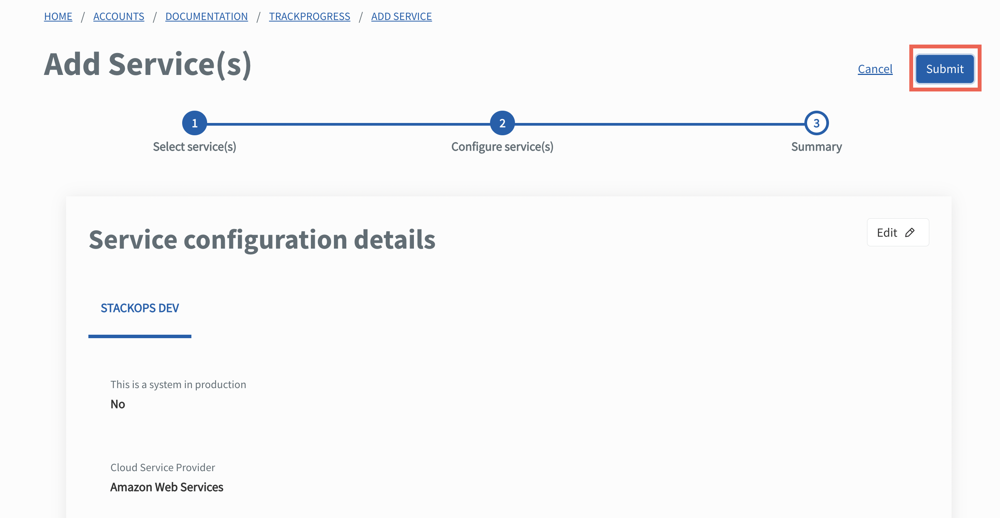
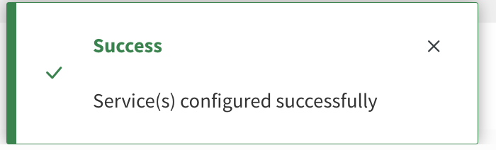

# Add and configure Services

Agencies need to add the subscribed SGTS Services required for the system(s) and configure the Services for each TechBiz system.

**To add and configure subscribed Services**

1. From the sidebar, click **Accounts**.
2. Go to the required TechBiz account.
3. Click **SYSTEMS**.
4. Choose the required system and click **Manage**.
5. Go to **SERVICES** \> **Add Services**.

> **Note:** Each SGTS Service will have different requirements for Service configuration. Click the triangle to view Service configuration instructions for the required SGTS Service.

  
SHIP-HATS

6. Click **SHIP-HATS**.
7. Click **Next**.

<kbd></kbd>

8. Click **Submit**.

<kbd></kbd>

The system record appears on the **Systems** page with status as **Provisioned**.

<kbd></kbd>

Go to [Access SHIP-HATS portal](https://docs.developer.tech.gov.sg/docs/ship-hats-portal/access-ship-hats-portal) for a guide to SHIP-HATS portal.

  

  
StackOps

6. Click **StackOps**.
7. Specify the required information for your Elastic deployment.

<kbd></kbd>

| Field name | Description |
| --- | --- |
| **This is a system in production**	| Select this checkbox to indicate if this deployment is for a system that is currently in production. |
| **Cloud Service Provider** | Select your cloud service provider for the deployment. |
| **Elastic Version Number** | Depending on the selected cloud service provider, this dropdown lists all the supported versions of ElasticSearch. |
| **Deployment Size**	| Depending on your daily data ingestion rate, choose the required size from the following options. The options are listed in alphabetical order.   **extra small** **medium** **small** **large** |
| **Sizing Details** | This section is displayed only when you specify the **Deployment Size**. When you select the required size, you can see the **Memory Size (MB)** and **Storage Size (GB)** that will be provisioned for this deployment under Sizing Details. It also displays the **Instance Type** and **Number of Zones** that are available for a particular **Instance**. |

8. Click **Next**.

9. Verify if the information displayed is correct before clicking **Submit**. When the Elastic deployment is successfully provisioned, the subscription and billing admins are notified via email. This email has the high-level configuration details attached in the *.csv* format.

10. Click **Submit**.

<kbd></kbd>

11. A success message is displayed. An email with an attached pdf file will be sent to you.

<kbd></kbd>

  

