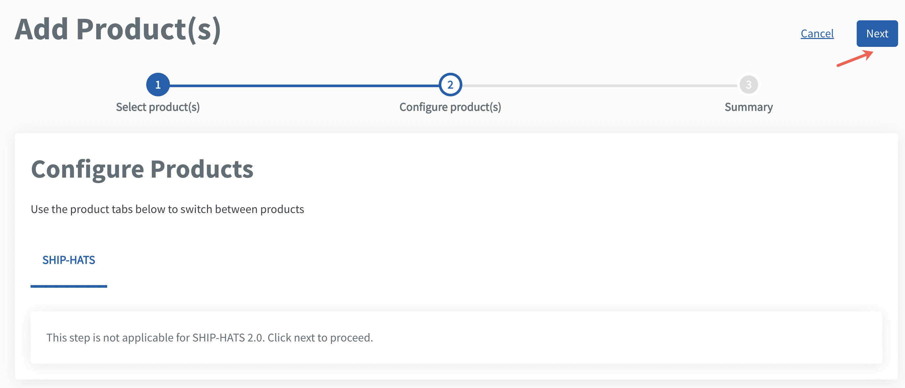
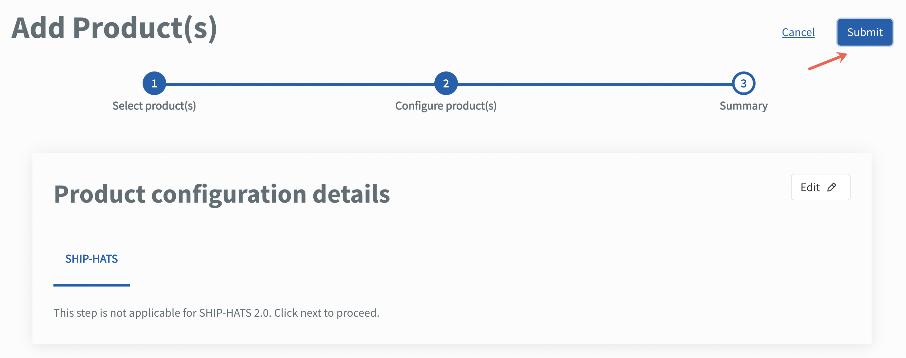
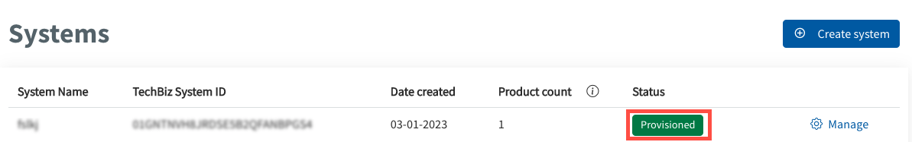
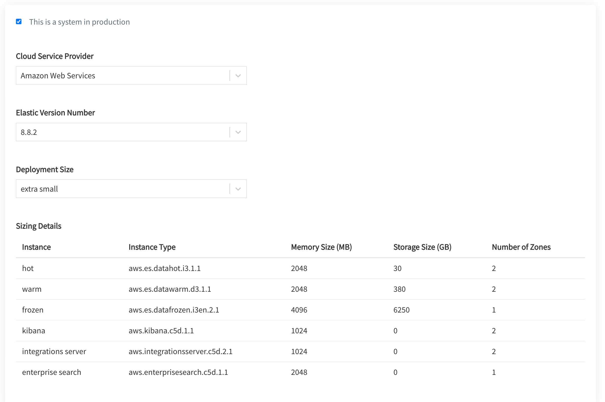

# Add and configure products

Agencies need to add the subscribed SGTS Products required for the system(s) and configure the Products for each TechBiz system.

**To add and configure subscribed products**

1. From the sidebar, click **Accounts**.
2. Go to the required TechBiz account.
3. Click **SYSTEMS**.
4. Choose the required system and click **Manage**.
5. Go to **PRODUCTS** \> **Add Products**.

> **Note:** Each SGTS service will have different requirements for product configuration. Click the triangle to view product configuration instructions for the required SGTS service.

  
SHIP-HATS

7. Click **SHIP-HATS**.
8. Click **Next**.

<kbd></kbd>

9. Click **Submit**.

<kbd></kbd>

The system record appears on the **Systems** page with status as **Provisioned**.

<kbd></kbd>

Go to [Access SHIP-HATS portal](https://docs.developer.tech.gov.sg/docs/ship-hats-portal/access-ship-hats-portal) for a guide to SHIP-HATS portal.

  

  
StackOps

7. Click **StackOps**.
8. Specify the required information for your Elastic deployment.

<kbd></kbd>

9. Click **Next**.

10. Verify if the information displayed is correct before clicking **Submit**. When the Elastic deployment is successfully provisioned, the subscription and billing admins are notified via email. This email has the high-level configuration details attached in the .csv format.

> **Note**: 	
**Sizing details** is displayed only when you specify the deployment size. When you select the required size, you can see the memory size(MB) and storage size(GB) that will be provisioned for this deployment under **Sizing details**. It also displays the **Instance type** and **Number of zones** that are available for a particular instance.

  

