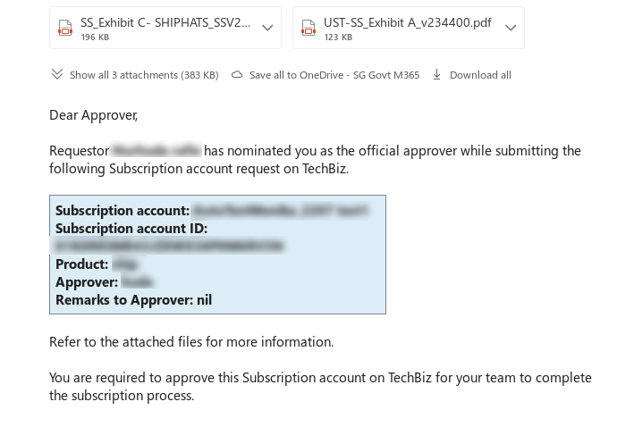

# Approve or reject account request

When a public officer submits a request to create an account, the **Approver** receives an email and a notification on the TechBiz portal to process the request. **Subscription admins** and **Billing admin** will also be notified.

> **Note:** Only CIOs or delegates can approve the account request.

---

## Approve or reject an account request

### Option 1: Approve or reject on TechBiz portal

1. Review the attachments in the email notification or in the TechBiz portal.  

   

2. Click the [link](https://portal.techbiz.suite.gov.sg/onboardingRequest/approvals/) provided in the email.

3. [Log in to TechBiz portal](https://docs.developer.tech.gov.sg/docs/techbiz-documentation/log-in-to-TechBiz-portal) using your [non-SE GSIB](https://docs.developer.tech.gov.sg/docs/techbiz-documentation/glossary) or [GMD](https://docs.developer.tech.gov.sg/docs/security-suite-for-engineering-endpoint-devices/additional-resources/glossary?id=gmd) device.  
   > **Note:** **Approvers** can also access the TechBiz portal using [TechPass](https://docs.developer.tech.gov.sg/docs/techbiz-documentation/log-in-to-TechBiz-portal?id=log-in-with-techpass) or [TechPass OTP](https://docs.developer.tech.gov.sg/docs/techbiz-documentation/log-in-to-TechBiz-portal?id=log-in-with-techpass-otp).

4. Select the account to be approved.  

5. Enter remarks for the requestor if required.  

6. Acknowledge that the information provided by the requestor is verified.  

---

### Option 2: Approve or reject through email

1. Review the attachments in the email notification or in the TechBiz portal.  

2. Respond to the email indicating **Approved** or **Rejected**. Select **Reply All** to complete the approval process.  

---

## Notifications

- The requestor will be notified by email.  
- The **subscription** and **billing admins** will also be notified.  
- The account’s status is displayed as **approved** when the request is approved.  
