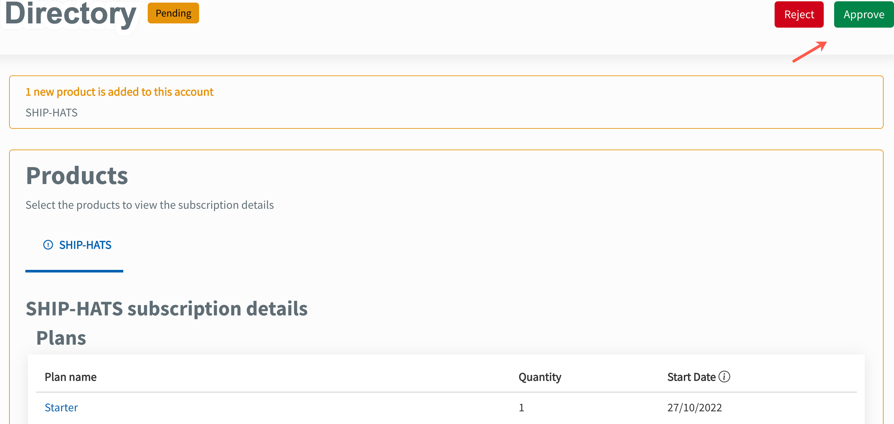

# Approve or reject TechBiz account

When a public officer submits a request to create an account, the **Approver** receives an email and a notification on the TechBiz portal to process the request. **Subscription admins** and **Billing admin** will also be notified.

> **Note:** Only a Deputy director or above can approve the account request.

## Approve or reject an account creation request

1. Review the attachments in the email notification or in the TechBiz portal.

> **Note**: **Approvers** using Gomax or SE GSIB device must respond to the email by selecting the Reply All option and copying (CC) the email to enquiries_ENP@tech.gov.sg in order to complete the approval process.

2. Click the link provided in the email.

3. [Log in to TechBiz portal](https://docs.developer.tech.gov.sg/docs/techbiz-documentation/log-in-to-TechBiz-portal) using your non-SE GSIB.

> **Note**: **Approver** can access TechBiz portal using [TechPass](https://docs.developer.tech.gov.sg/docs/techbiz-documentation/log-in-to-TechBiz-portal?id=log-in-with-techpass) or [TechPass OTP](https://docs.developer.tech.gov.sg/docs/techbiz-documentation/log-in-to-TechBiz-portal?id=log-in-with-techpass-otp).
 
4. Select the account to be approved.

5. Enter remarks for the requestor if required.

6. Acknowledge that the information provided by the requestor is verified.

7. Click **Approve** or **Reject**.

<kbd></kbd>

- The requestor will be notified through email. 
- The **subscription** and **billing admins** will also be notified. 
- The account's status is displayed as **approved** when the request is approved.
