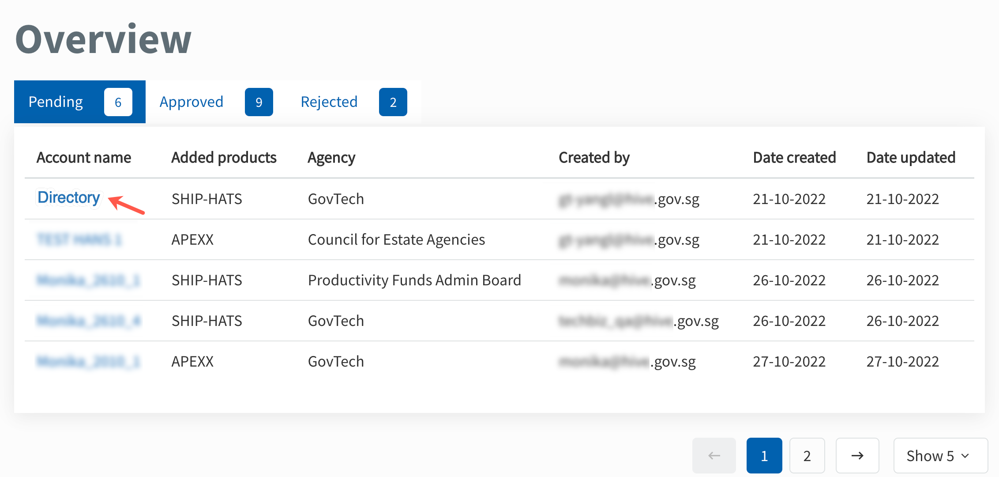
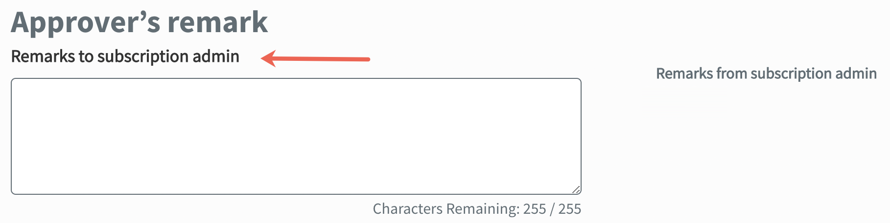
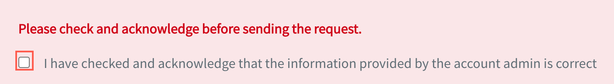

# TechBiz account

To subscribe to [Singapore Government Tech Stack (SGTS)](https://www.developer.tech.gov.sg/singapore-government-tech-stack/overview/index.html) products, agencies need to have an account in TechBiz.

An account allows agencies to subscribe to SGTS products, add systems to the account, manage subscription plans and view billing details. An agency can have one account for multiple systems or an account for each system. Refer to FAQ for more information.

## Create account

Prerequisites

- Public officers using a [non-SE GSIB](https://docs.developer.tech.gov.sg/docs/techbiz-documentation/glossary) device can create an account.

- Have the following information ready before proceeding:
  - Name, organisation email address and handphone number
    - **Primary subscription admin**
    - **Secondary subscription admin**
    - **Billing admin**
 - Name, organisation email address, and designation
    - **Approver** (Deputy Director or above)
  - Account name
  - Billing details
    - **Sub business unit (SBU)**
    - **Agency department** name, **Cost centre** , and **Fund centre**. (For GovTech only)
  - Subscription plans for the required SGTS product(s).
  - Supporting documents. (Optional)

**To create account**

1. In **Overview**, click **Manage accounts**.

2. Click **Create account**.

3. To download the agreement, click **Download the SGTS agreement** link.

4. Agree to the terms and conditions of the **GovTech Universal Service Terms** and **SGTS Service Sheet**.

5. Click **Next**.

<kbd></kbd>

6. Enter the following **Account details**.

> **Notes:**
> - All fields are mandatory, unless mentioned otherwise.
> - Click **Save draft** at any point before submitting your request. Your draft will be saved automatically subsequently.  
> - You can access the saved draft within 14 days to continue with the account creation request.

| **Field Name** | **Description** |
| --- | --- |
| **Agency name** | Select your agency name from the drop-down list. |
| **Account name** | Enter the account name. Account name can contain alphanumeric characters. |
| **Account ID** | A unique **Account ID** is automatically generated and cannot be edited. Your **Account ID** is common across all SGTS products that your agency has subscribed to under this account.

7. Enter the **Subscription admins** details.

> **Notes:**
> - **Primary subscription admin** and **Secondary subscription admin** must be public officers with a valid organisation email address.
> - If the public officer does not have a TechPass account, it will be created automatically after the system account creation request is approved.

| **Field Name** | **Description** |
| --- | --- |
| **Primary subscription admin** | This section allows you to enter the details of the **Primary subscription admin**. The requestor is assigned as the **Primary subscription admin** by default.  Note: **Primary subscription admin** cannot be the **Secondary subscription admin** or vice-versa. |
| **Email address** | The organisation email address of the requestor is automatically displayed and cannot be edited. |
| **First name, Last name, and Contact number** | These details will be automatically displayed if the email address of the requestor is linked to a TechPass account. If not, the requestor needs to enter them manually.  Note: These details are masked except for the first and last character of first and last names, and the last 3 digits of the contact number. |
| **Secondary subscription admin** | This section allows you to enter the details of the **Secondary subscription admin**. |
| **Email address** | Enter the organisation email address of the **Secondary subscription admin**.|
| **First name, Last name, and Contact number** | These details will be automatically displayed if the email address of the **Secondary subscription admin** is linked to a TechPass account. If not, the requestor needs to enter details manually. |

8. Enter the **Billing details**.

| **Field Name** | **Description** |
| --- | --- |
| **Email address** | Enter the organisation email address of the **Billing admin**.  Note: **Billing admin** must be a public officer with a valid organisation email address. |
| **First name, Last name, and Contact number** | These details will be automatically displayed if the email address of the **Billing admin** is linked to a TechPass account. If not, the requestor needs to enter them manually. |
| **Agency department** **Cost center** **Fund center** | Enter your department name. Enter the **cost center** code for your agency. This code will be used by the Finance team for internal GovTech inter-department charging or journal entry.  Enter the **fund center** details. Note: The above field details are applicable to GovTech accounts only. |
| **SBU code** | Applicable only for agencies other than GovTech.  Enter the **Sub business unit**. Note: To view the complete list of agency departments and business units, refer to [list of ministries and statutory boards.](https://www.vendors.gov.sg/UsefulReferences/MinStatuaryBoards.aspx) |

9. Click **Next**.

10. In **Select product(s)**, choose the required **SGTS products** and click **Next**.

11. In **Select plan(s)**, go to the required product tab and select subscription plans for the selected SGTS products.

> **Note:** You will be able to see a tab for each SGTS product that you have selected.

12. By default, the date displayed is automatically generated. Click **Start date** to select the required date.

> **Note:** While selecting a date, you will not be able to select 3 consecutive working days from the current date and before the last 3 working days of the month. For more information, refer to the field description table.

13. In **Select a plan** , provide the subscription plan details.

| **Field Name** | **Description** |
| --- | --- |
| **Select subscription period** | Select the start date of the subscription.
This is the date when your agency intends to start using the subscribed SGTS products.  Note: While selecting a date, you will not be able to select 3 consecutive working days from the current date and the last 3 business days of the month as we need time for the following:  - **Agency approver** to approve system account request - **Technical admin/Subscription admin** to configure the product details.  - SGTS Product teams to provision the required resources. |
| **Product agreement** | Click to view the terms and conditions of the product. |
| **Select a plan** | Select the required subscription plan for a product. The displayed subscription plans contain details of the chargeable items in a product and their charges. |

14. If you are subscribing to more than one SGTS product, repeat **steps 11-13** and click **Next**.

15. In **Approver details**, enter the required information and click **Next**.

> **Notes:**
> - **Approver** must be a public officer with a valid organisation email address.
> - **Approver** needs to be a Deputy director and above.

| **Field Name** | **Description** |
| --- | --- |
| **Approver name, email, and designation** | Enter the approver's full name, organisation email address, and designation. |
| **Upload documents** | This field is optional.  Click **Choose a file** to upload supporting documents. For example, approval email.
 - Total files uploaded can be up to 10MB. - A maximum of 50 files can be attached for each account creation request- Multiple files can be selected to do a bulk upload. - Supported file types: .jpg, .jpeg, .png, .pdf, .zip, .msg, and .svg. - File names can contain alphanumeric characters and special characters such as space, hyphen, underscore, and period. |
| **Remarks to Approver** | This field is optional. Specify the reasons for submitting this request.|

16. Verify if the information displayed on this page is correct and then click **Submit**.

17. In **Submit for approval** , select all the checkboxes to agree to the terms and conditions and click **Submit**.

A confirmation message will be displayed to verify that the account has been submitted for approval.

## Account approval

When a public officer submits a request to create an account, the **Approver** receives an email and a notification on the TechBiz portal to process the request. **Subscription admins** and **Billing admin** will also be notified.

> **Note:** Only a deputy director or above can approve the account request.

**To approve or reject a system account creation request**

1. Review the attachments in the email notification or in the TechBiz portal.

2. Click the link provided in the email.

3. [Log in to TechBiz portal](https://docs.developer.tech.gov.sg/docs/techbiz-documentation/log-in-to-TechBiz-portal) using your non-SE GSIB.
 
4. Select the account to be approved.

<kbd></kbd>

5. If required, enter remarks for the requestor.

<kbd></kbd>

6. Acknowledge that you have verified the information provided by the requestor.

<kbd></kbd>

7. Click **Approve** or **Reject**.

<kbd></kbd>

The requestor will receive the outcome of the approval request through email. **Subscription** and **Billing admins** will also be notified. The account will be listed on the **Accounts** page with an **approved** status when the request is approved.