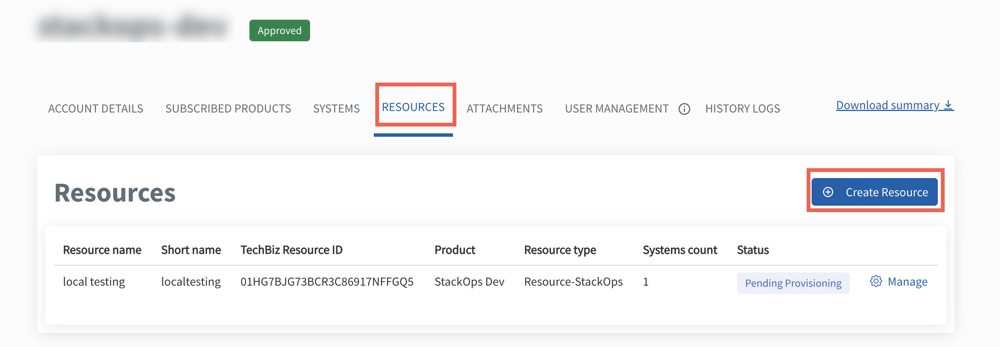

# Create and configure **Resources**

Agencies must create and configure their **Resources** in TechBiz for their subscribed products. Each product may use different terms for what a **Resource** means, so the labels and descriptions will change depending on the product you select.

> **Note:** Field names such as **Resource name**, **type**, or **description** will automatically reflect the terminology specific to the product you choose (e.g. *Organisation* for APEX, *Deployment* for StackOps, *Project* for CFT).
> **Note:** Field names such as **Resource name**, **type**, or **description** will automatically reflect the terminology specific to the product you choose (e.g. *Organisation* for APEX, *Deployment* for StackOps, *Project* for CFT).  
> [View the full list of product-specific resource terminology →](/create-subscription-acc/resource-terminology-by-product))

You must create a **System** before creating a **Resource**.

---

## To create and configure a **Resource**:

1. From the sidebar, click **Accounts**.
2. Go to the relevant TechBiz account.
3. Click the **RESOURCES** tab.
4. Click **Create Resource**.

5. Select the **Product**.
6. Select the **Resource type**, if applicable.

> **Note:** This selection is not applicable for SHIP-HATS.

7. Enter a **Resource name**:
   - Must begin with a letter or digit.
   - Must include at least one letter.
   - Allowed characters: `.`, `&`, `_`, `*`, `@`, `/`, `-`, spaces, and parentheses.
   - Maximum 50 characters.
   - Cannot consist only of the following words:  
     `default`, `dev`, `local`, `prod`, `production`, `stackops`  
   - These words are allowed as part of longer names (e.g. `prod-server1`).

8. A **Resource short name** will be automatically generated. You can edit it before submission but not after.

9. Provide a **Resource description** (max 255 characters).

10. Fill in any other fields shown on screen (e.g. contact email).

11. Select one or more **Systems** to tag to this **Resource**.

> **Note:** StackOps only allows tagging one System per **Resource**.

12. (Optional) Add **Tags** to categorise and filter your **Resources**:
   - Tags are case-insensitive.
   - Tags cannot contain colons `:`.
   - Maximum 255 characters each.

13. Click **Submit**.

A success message will confirm your **Resource** has been created.

---

## Product-specific instructions

Some products will show extra fields depending on what they require.

  
<strong>SHIP-HATS</strong>

This step is not applicable for SHIP-HATS.  
To manage **Resources**, go to the [SHIP-HATS portal](https://portal.ship.gov.sg/).

  
<strong>StackOps</strong>

You will be asked to fill in additional deployment details:

| Field | Description |
| --- | --- |
| **This is a system in production** | Tick if the deployment is for a live system. |
| **Cloud Service Provider** | Select your cloud provider. |
| **Elastic Version Number** | Lists available versions based on your provider. |
| **Deployment Size** | Choose from: `extra small`, `small`, `medium`, or `large`. |
| **Sizing Details** | Appears once a size is selected. Includes memory, storage, instance type, and number of zones.   **Need a custom size?** [Raise a service request](https://go.gov.sg/stackops-support). |

  
<strong>Cloud File Transfer (CFT)</strong>

You will be asked to fill in the following fields:

| Field | Description |
| --- | --- |
| **Project name** | Enter the name for your CFT Project. |
| **Project short name** | Auto-generated. You may edit before submission. |
| **Project description** | Briefly describe the purpose of this Project. |
| **Existing Project ID (Migration)** | *(Optional)* Enter if you are migrating from a previous setup. |

  
<strong>APEX</strong>

You will be asked to fill in the following fields:

| Field | Description |
| --- | --- |
| **Organisation name** | Enter the organisation name. |
| **Short name** | Auto-generated. You may edit before submission. |
| **Organisation description** | Brief description of the organisation’s purpose. |
| **Primary Contact Email** | Enter the main point of contact. |
| **Secondary Contact Email** | (Optional) Enter an additional contact. |

