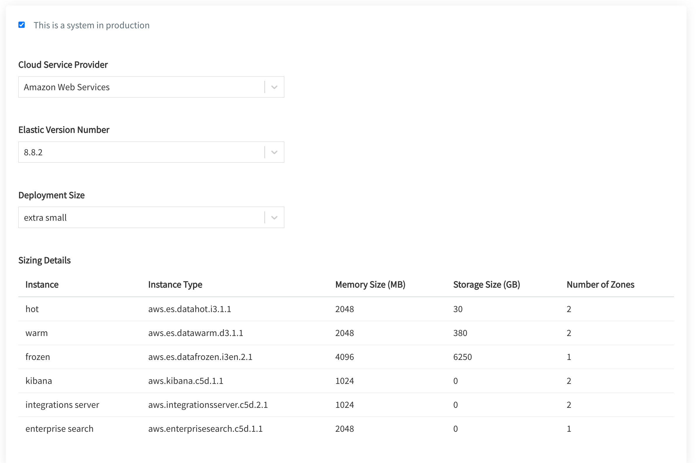

# Create and configure Resources

Agencies are required to create and configure their resources required for their systems within the TechBiz.

You need to create your system before creating your resources.

**To create and configure subscribed Resources**:

1. From the sidebar, click **Accounts**.
2. Go to the required TechBiz account.
3. Click **RESOURCES**.
4. Click **Create Resource**.

5. Select the required product.
6. Select the required **resource type**.
> **Note**: Currently, this selection is not applicable for SHIP-HATS.
7. Enter a resource name.

> **Note**: A short name will be automatically generated based on your input and cannot be altered after submission.

8. Provide a resource description.

9. Select the required system(s) for the resource, and if required, tag multiple systems for resource provisioning.

> **Note**: StackOps currently can only tag one system to one resource.

Each SGTS Product will have different requirements for Resource configuration. Click the triangle icon below to view Resource configuration instructions for the required SGTS Product.

  
SHIP-HATS

This step is currently not applicable for SHIP-HATS. To configure resources, please proceed to the [SHIP-HATS portal](https://portal.ship.gov.sg/).

  

  
StackOps

10. Specify the required information for your Elastic deployment.

| Field name | Description |
| --- | --- |
| **This is a system in production**	| Select this checkbox to indicate if this deployment is for a system that is currently in production. |
| **Cloud Service Provider** | Select your cloud service provider for the deployment. |
| **Elastic Version Number** | Depending on the selected cloud Product provider, this dropdown lists all the supported versions of ElasticSearch. |
| **Deployment Size**	| Depending on your daily data ingestion rate, choose the required size from the following options. The options are listed in alphabetical order.   **extra small** **medium** **small** **large** |
| **Sizing Details** | This section is displayed only when you specify the **Deployment Size**. When you select the required size, you can see the **Memory Size (MB)** and **Storage Size (GB)** that will be provisioned for this deployment under Sizing Details. It also displays the **Instance Type** and **Number of Zones** that are available for a particular **Instance**.    **Note**: If you need a custom size, you are required to raise a [service request](https://go.gov.sg/stackops-support). |

11. Click **Submit**.

12. A success message will be displayed. 

  

