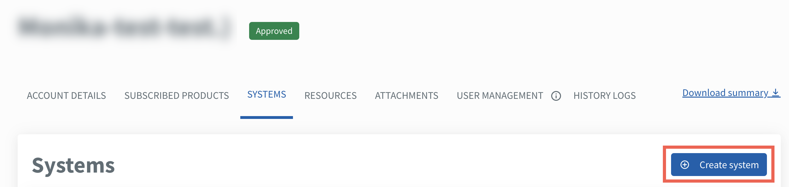

# Create system

A TechBiz system allows agencies to share usage of their [Singapore Government Tech Stack (SGTS)](https://www.developer.tech.gov.sg/singapore-government-tech-stack/overview/index.html) product subscriptions which can be configured and managed individually. A system is connected to a TechBiz account. An account can have multiple systems. Refer to the [FAQ](https://docs.developer.tech.gov.sg/docs/techbiz-documentation/faq) for more information.

Agencies need to add and configure TechBiz systems to manage the subscribed SGTS Services.

This sections guides how subscription admins can create a TechBiz system using a TechBiz account.

## Audience

- Subscription admins of a TechBiz account.

## Prerequisites

- You need a [non-SE GSIB](https://docs.developer.tech.gov.sg/docs/techbiz-documentation/glossary) device.
- You need to be logged in to [TechBiz](https://portal.techbiz.suite.gov.sg/) portal.
- An approved **TechBiz account**.

**To create a TechBiz system**

1. From the sidebar, click **Accounts**.
2. Go to the required TechBiz account.
3. Click **SYSTEMS** \> **Create system**.

<kbd></kbd>

5. Enter the following details.

> **Note:** Unless mentioned otherwise, all fields are mandatory.

| **Field Name** | **Description** |
| --- | --- |
| **System name** | Enter the system name.   **Note:** System name can have a minimum of 1 character and maximum of 50 characters. |
| **TechBiz system ID** | A unique TechBiz system ID is automatically generated and cannot be edited. The TechBiz system ID is common across all subscribed SGTS Services under this account. |
| **System Description** | Enter the description of the system. |
| **Digital Governance Platform (DGP) ID** | Indicate if your system has a DGP ID. Select **Yes** , **I have a DGP ID** or **No, I do not have a DGP ID**.     **Note:** Refer to [FAQ](https://docs.developer.tech.gov.sg/docs/techbiz-documentation/faq) for more information. |
| **Sub-system ID and description** | The sub-system DGP ID and description will be available if **Yes, I have a DGP ID** is selected. Select your DGP System ID. The System description will automatically appear.    **Note:** If you are unable to locate your DGP ID, click **No, I do not have a DGP ID** and update it when it is available.    For more information, approach your assigned DGP Agency Coordinator. Refer to [Role of Agency Coordinator and Contributor](https://ssp.dgp.tech.gov.sg/Faq)    |

6. Enter the **technical admin** details.

| **Field Name** | **Description** |
| --- | --- |
| **Technical admin** | A Technical admin can edit and manage systems. This section allows you to enter the details of the Technical admin. There can be up to three technical admins.    **Note:** Public officers and vendors can be technical admins. |
| **Email address** | Enter the organisation email address of the Technical admin. |
| **First name, Last name, Contact number and Organisation**. | Enter the first name, last name, contact number and the organisation of the Technical admin. |

7. Click **Add another** to add more technical admins.
8. Click **Next**.
9. Review the system details and click **Submit**.

The system record appears on the **Systems** page with status as **Pending Configuration**.

<kbd></kbd>

Proceed to [Add and configure Services](add-and-configure-products.md)  complete the configuration.
