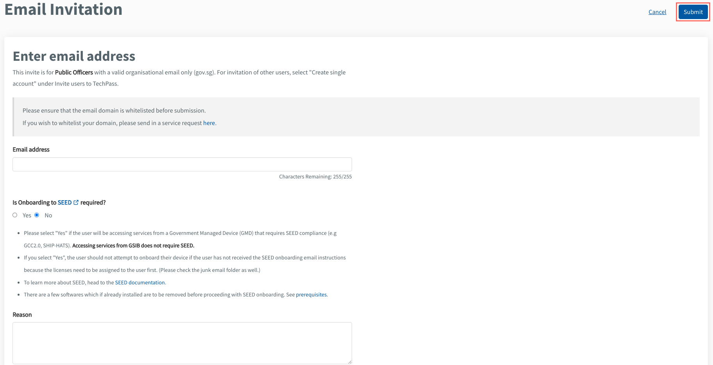

# Invite users

Public officers can now use TechBiz portal to invite other public officers and vendors to [TechPass](https://docs.developer.tech.gov.sg/docs/techpass-user-guide/) and [SEED](https://docs.developer.tech.gov.sg/docs/security-suite-for-engineering-endpoint-devices/).

There are three ways a public officer can invite users:

1. [Email invitation](#email-invitation) - Use this option to invite public officers.
2. [Create user account](#create-user-account) - Use this option to invite vendors.
3. [Batch upload](#batch-upload) - Use this option to invite more than one public officer and vendor.

## Prerequisites

- You should be a public officer with a [non-SE GSIB](glossary) device.

Have the following details of the invitee before proceeding:

- Organisational email address of the invitee.
  - For public officers, it is the Whole of Government email address of the public officer.
  - For vendors, it should be the email address of the invitee provided by the vendor organisation.
- **First name** and **Last name** of the invitee. While inviting a vendor, enter the vendor's full name as the TechPass username.
- **Contact number**
- **Organisation** name and **TechPass username** (only for vendors)

## Email invitation

**To invite public officers**

1. From the sidebar, click **Invite users** > select **Email invitation**.

<kbd></kbd>

2. Enter the required details and click **Submit**.

<kbd></kbd>

Refer to the following for more information on the required details.

| 
Field Name
  | Description |
| :------------------------------------------ |:-------------|
| **Email address** | Enter the email address of the public officer who requires a TechPass account. Email address must be in the format of \<your_name>@\<acronym for your agency>.gov.sg. for public officers.  |
| **Is onboarding to [SEED](https://docs.developer.tech.gov.sg/docs/security-suite-for-engineering-endpoint-devices/#/) required?** | Select **Yes** if the public officer needs SEED provisioning.   **Note**: SEED provisioning is needed to access SGTS products from the Internet device. |
| **Reason** | Enter the **Reason** why the public officer needs a TechPass account. |

## Create user account

**To invite vendors**

1. From the sidebar, click **Invite users** > select **Create account**.

<kbd></kbd>

2. Enter the required details and click **Submit**.

<kbd></kbd>

Refer to the following for more information on the required details.

| 
Field Name
  | Description |
| :------------------------------------------ |:-------------|
| **Email address**| Enter the organisational email address of the vendor who requires a TechPass account.    **Note:** The email address must be the email address provided by the vendor. |
| **TechPass username** | Enter the required username for the TechPass account. |
| **First name,** **Last name,** **Contact number,** **Organisation, and Department**| Enter the required details. Note: **Department** is optional. |
| **Is onboarding to [SEED](https://docs.developer.tech.gov.sg/docs/security-suite-for-engineering-endpoint-devices/#/) required?** | Indicate **Yes** if the vendor needs SEED provisioning.  **Note**: SEED provisioning is needed to access SGTS products from the Internet device. |
| **Reason** | Enter the **Reason** why the vendor needs a TechPass account. |

## Batch upload

**To invite multiple Public officers or vendors**

1. From the sidebar, click **Invite users** > select **Batch upload**.
2. Click **Download excel template link**.

<kbd></kbd>

3. Open the downloaded .xlsx file extension, specify the required details and save the file.
4. In **Upload user list** section, select **Choose a file**.

<kbd></kbd>

5. Select the saved file and upload it.
6. Click **Submit** > **Confirm**.

> **Note**: Users with an existing TechPass account is flagged as a duplicate entry.

<kbd></kbd>

A confirmation message is displayed.

- To view or edit user details, click the ellipsis > **View details**.

<kbd></kbd>

- To delete a single user, click **Remove**.

<kbd></kbd>

- To delete all users, click **Reset** > **Confirm**.

<kbd></kbd>

## View status of invited users

Public officers can view the status of the users they have invited using TechBiz portal. **Invite User Status** displays the TechPass and SEED onboarding status of the invited users.

**To view the status of invited users**

1. From the sidebar, click **Invite users** > select **Invite User Status**.

<kbd></kbd>

2.  Click **Resend invite** to re-invite users. Invitations can be re-sent once a day.

>**Notes:**
> - Only users invited via TechBiz portal will be displayed on this list. 
> - First name and last name are displayed if the user signed up for TechPass via the TechPass portal or if the TechPass account was created through [create account](#create-account) or [batch upload](#batch-upload). 
