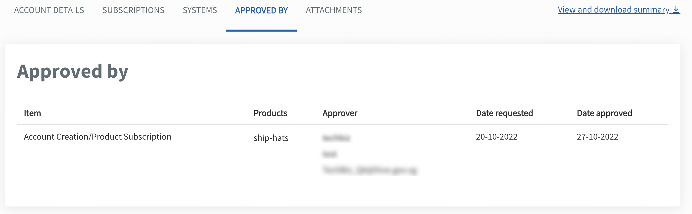

# Manage account

This section guides how subscription administrators can edit and manage account details on TechBiz. 

## Edit account details

The **subscription administrator** has to complete the following steps:

1. In **Overview,** click **Manage accounts**.

2. Select **Approved** from the **Status** dropdown list to view all the **approved** accounts.

3. Select the required account.

4. Click **Account details**.

5. Click **Edit**.

6. Modify the required details and click **Submit**.

> **Note**: If an administrator is removed, it will revoke their access to the account.

7. Click **View and download summary** to download the information in .pdf extension.

> **Note**: Refer to **Create account** for the required details.

## View approver details

1. In **Overview,** click **Manage accounts**.

2. Select **Approved** from the **Status** dropdown list to view all the **approved** accounts.

3. Select the required account.

4. Click **Approved by**.

5. The following details is displayed:

<kbd></kbd>

## View attachments submitted for account approval and subscription

1. In **Overview,** click **Manage accounts**.
2. Select **Approved** from the **Status** dropdown list to view all the **approved** accounts.
3. Select the required account.
4. Click **Attachments**.
5. The following details is displayed:

<kbd></kbd>

1. Click the attachments in the item list to download the .pdf file.

## Manage draft

Primary subscription administrator can continue or edit a draft and submit the draft. Both primary and secondary subscription administrators can manually trigger an approval reminder on TechBiz portal.

### Edit draft

The primary subscription administrator can continue editing a draft account at any point after saving the draft.

1. In **Overview**, click **Manage accounts**.

2. Select **Draft** from the **Status** dropdown list to view all the draft accounts.

3. Select the required account to edit the details.

4. The primary subscription administrator can continue with the [account creation](/create-account.md).

You can access the saved draft within 14 days from the date of account creation to continue with the request.

### Submit draft

The primary subscription administrator can submit the draft upon completion.

1. In **Overview**, click **Manage accounts**.

2. Select **Draft** from the **Status** dropdown list to view all the draft accounts.

3. Select the required account to edit the details.

4. Complete the remaining steps.

5. Click **Submit**.

A confirmation message is displayed to verify that the account has been submitted for approval.

## Send a reminder for account approval

The primary and secondary subscription administrator can manually trigger an approval reminder.

1. In **Overview**, click **Manage accounts**.

2. Select **Pending** from the **Status** dropdown list to view all the pending accounts.

3. Select the required account.

3. Click **select reminder for approval**.

<kbd></kbd>

The approver will receive a reminder email to approve the account.
