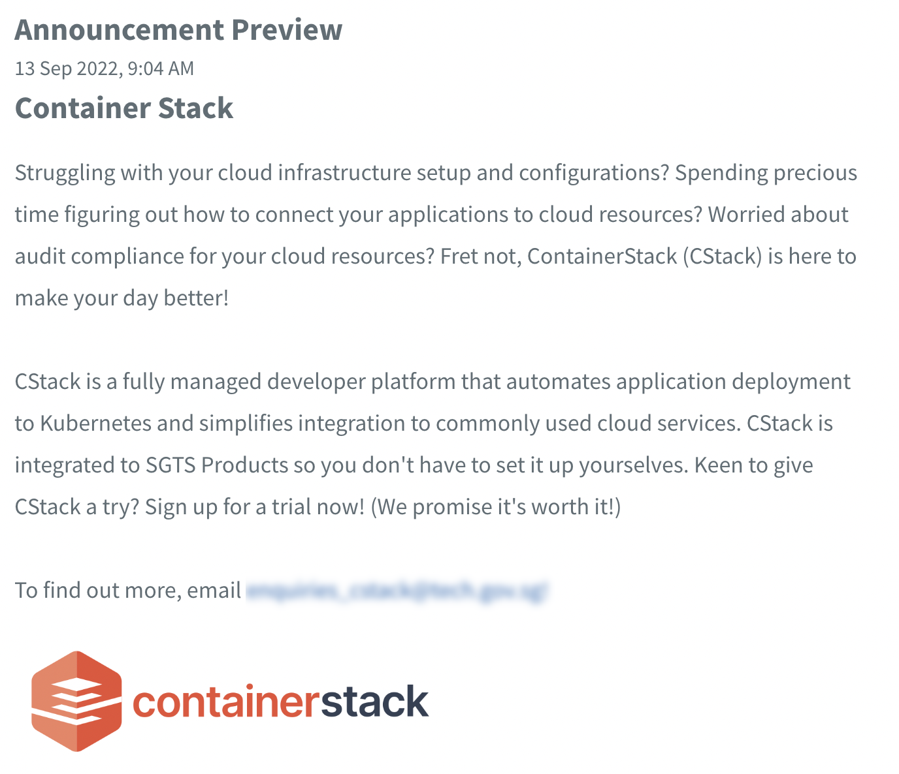

# Manage announcements

This section guides how administrators can create announcements and manage them on [TechBiz portal](https://portal.techbiz.suite.gov.sg/). Announcements allow SGTS Service owners to broadcast messages on TechBiz portal. It appears as a pop up after a user has logged in to TechBiz portal.

<kbd></kbd>

Administrators can:

- Create announcements
- Edit and delete announcements
- Unpublish announcements

## To create an announcement

1. In **Overview**, select Manage announcements.
2. Click **Add new**.
3. Have the following information ready before proceeding:
    - Service
    - Title
    - Start and end date
    - Content
    - Relevant image assets

> **Note:** You can include .jpeg, .svg, .png and .gif images. Files must be less than 10MB.

4. Preview your announcement at the bottom of the page.

<kbd></kbd>

5. Click **Publish** to save the announcement.

## To edit announcements

1. In **Overview**, select **Manage announcements**.
2. Select the announcement to be edited and click the ellipsis icon corresponding to it.
3. Click **Edit** to modify content or publishing date.

<kbd></kbd>

4. Click **Save** after making changes.

## To delete announcements

1. In **Overview**, select **Manage announcements**.
2. Select the announcement to be deleted and click the ellipsis icon corresponding to it.
3. Click **Edit** to modify content or publishing date.

<kbd></kbd>

5. Click **Delete** to remove the announcement.

<kbd></kbd>

6. Click **Confirm**.

<kbd></kbd>

## To unpublish announcements

1. In **Overview**, select **Manage announcements.** Select the announcement to be unpublished and click the ellipsis icon corresponding to it. 
2. Click **Unpublish.**

<kbd></kbd>

3. Select **Confirm** to unpublish.

<kbd></kbd>

A confirmation message will be displayed to verify that the announcement has been unpublished.

> **Notes:**
> - There are 3 different statuses.
> - **Publishing** refers to announcements that have been saved and will be published on the start date.
> - **Published** refers to announcements that are currently active.
> - **Unpublished** refers to announcements that have reached the end date.
