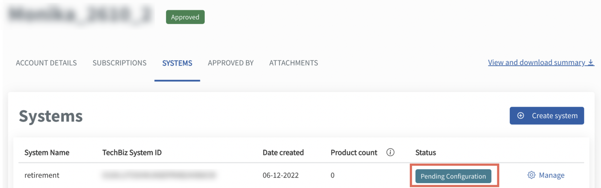

# Manage draft account

This section guides how Primary subscription admin can continue with the draft and submit the complete draft.

- [Edit draft](#edit-draft)
- [Submit completed draft](#submit-completed-draft)

## Audience

- Primary subscription admins of a TechBiz account.

## Prerequisites

- You need a [non-SE GSIB](https://docs.developer.tech.gov.sg/docs/techbiz-documentation/glossary) device.
- You need to be logged in to [TechBiz](https://portal.techbiz.suite.gov.sg/) portal.
- A **TechBiz account** in draft status.

## Edit draft

The primary subscription admin can continue editing a draft account after saving the draft.

**To edit draft**

1. From the sidebar, click **Accounts**.
2. Select **DRAFT** from the **Status** dropdown list to view all the draft accounts.
3. Select the required account.
4. Continue with the [account creation.](https://docs.developer.tech.gov.sg/docs/techbiz-documentation/create-account)
5. Click **Save draft** to save. 

<kbd></kbd>

> **Note:** You can access the saved draft within 14 days from the date of account creation to continue with the request. The draft will be automatically deleted after 14 days.

## Submit completed draft

The primary subscription admin can submit the draft upon completion.

1. From the sidebar, click **Accounts**.
2. Select **DRAFT** from the **Status** dropdown list to view all the draft accounts.
3. Select the required account.
4. Complete the remaining steps.

> **Note:** Refer to [Create TechBiz account](https://docs.developer.tech.gov.sg/docs/techbiz-documentation/create-account) for more information.

5. Review the account details and click **Submit**.
6. When prompted to confirm the changes, click **Confirm**.

A confirmation message is displayed to verify that the account has been submitted for approval.