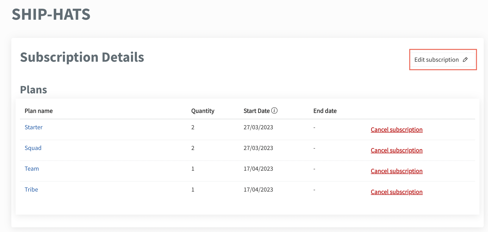
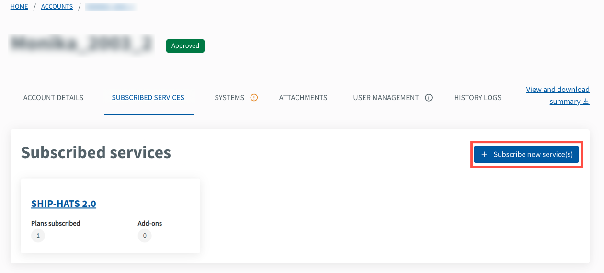

# Manage subscriptions

This section guides how subscription admins can do the following for an existing subscription:

- [View subscription details](#view-subscription-details)
- [Edit subscription details](#edit-subscription-details)
- [Subscribe to other SGTS Services](#subscribe-to-other-sgts-services)
- [Cancel subscription](#cancel-subscription)

## Audience

- Primary and secondary subscription admins of a TechBiz account.
- Billing admin of a TechBiz account.

> **Note:** The Billing admin of a TechBiz account can view the account and subscription details but can't edit the details.

## Prerequisites

- You need a [non-SE GSIB](https://docs.developer.tech.gov.sg/docs/techbiz-documentation/glossary) device.
- You need to be logged in to [TechBiz](https://portal.techbiz.suite.gov.sg/) portal.
- An approved [**TechBiz account**](https://docs.developer.tech.gov.sg/docs/techbiz-documentation/create-account).

## View subscription details

Billing and subscription admins can view the subscription plans and their details of the Services subscribed using a TechBiz account.

**To view the subscription details of a TechBiz account**

1. From the sidebar, click **Accounts**.
2. Select **APPROVED** from the **Status** dropdown list to view all the approved accounts.
3. Select the required account.
4. Click **SUBSCRIBED SERVICES** tab.

<kbd></kbd>

5. Select the required Service(s) to edit. For example, SHIP-HATS.

<kbd></kbd>

6. To view the plan details of a SGTS service, select the required service and click the **Plan name**.

<kbd></kbd>

The **Plan details** are displayed.

<kbd></kbd>

> **Note:** The **Edit subscription** and **Cancel subscription** options are not available for Billing admins.

## Edit subscription details

**Subscription admins** can edit subscription details such as start date and subscription plans. You can also [add other SGTS Services to the existing subscriptions](#subscribe-to-other-sgts-services).

**To edit subscription details of a TechBiz account**

1. From the sidebar, click **Accounts**.
2. Select **APPROVED** from the **Status** dropdown list to view all the approved accounts.
3. Select the required account.
4. Click **SUBSCRIBED SERVICES** tab.

<kbd></kbd>

5. Select the required service to edit. For example, SHIP-HATS.

<kbd></kbd>

6. Click **Edit subscription**.

<kbd></kbd>

7. You can increase plans and add-ons. To decrease a plan, contact the respective SGTS support team.
8. Click **Next**.

<kbd></kbd>

9. Review the changes and click **Submit**.

<kbd></kbd>

10. When prompted to confirm the changes, click **Confirm**.

## Subscribe to other SGTS Services

Subscription admins can subscribe to other SGTS Services using TechBiz portal.

**To subscribe to other SGTS Services**

1. From the sidebar, click **Accounts**.
2. Select **APPROVED** from the **Status** dropdown list to view all the approved accounts.
3. Select the required account.
4. Click **SUBSCRIBED SERVICES** tab \> **Add subscription**.

<kbd></kbd>

5. Select the required SGTS Services and click **Next**.

For more information, go to [**Create subscription account**](request-for-techbiz-account.md) and follow from step 4 onwards to complete the subscription.

## Cancel subscription

Contact the respective SGTS support team for more information.