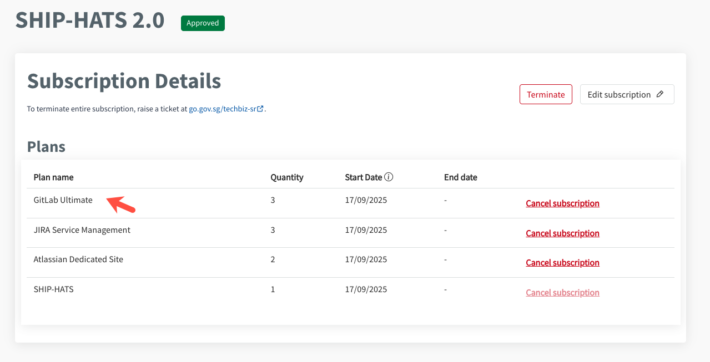
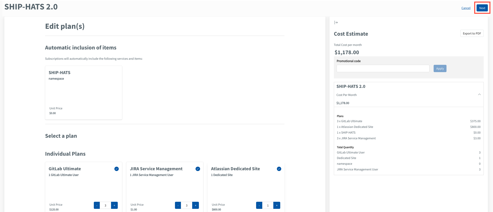

# Manage subscriptions

This section guides how subscription admins can do the following for an existing subscription:

- [View subscription details](#view-subscription-details)
- [Edit subscription details](#edit-subscription-details)
- [Subscribe to other SGTS Products](#subscribe-to-other-sgts-products)
- [Cancel subscription](#cancel-subscription)

## Audience

- Primary and secondary subscription admins of a TechBiz account.
- Billing admin of a TechBiz account.

> **Note:** The Billing admin of a TechBiz account can view the account and subscription details but cannot edit the details.

## Prerequisites

- You need to use a COMET, non-SE GSIB, or GMD (Government Managed Device).
- You need to be logged in to the [TechBiz portal](https://portal.techbiz.suite.gov.sg/).
- An approved [**TechBiz account**](https://docs.developer.tech.gov.sg/docs/techbiz-documentation/create-account).

## View subscription details

Billing and subscription admins can view the subscription plans and their details of the Products subscribed using a TechBiz account.

**To view the subscription details of a TechBiz account**

1. From the sidebar, click **Accounts**.
2. Select **APPROVED** from the **Status** dropdown list to view all the approved accounts.
3. Select the required account.
4. Click **SUBSCRIBED Products** tab.

   

5. Select the required Product(s) to view. For example, SHIP-HATS.

   

6. To view the plan details of an SGTS Product, select the required Product and click the **Plan name**.

   

The **Plan details** are displayed.

   

> **Note:** The **Edit subscription** and **Cancel subscription** options are not available for Billing admins.

## Edit subscription details

**Subscription admins** can edit subscription details such as start date and subscription plans. You can also [add other SGTS Products to the existing subscriptions](#subscribe-to-other-sgts-products).

**To edit subscription details of a TechBiz account**

1. From the sidebar, click **Accounts**.
2. Select **APPROVED** from the **Status** dropdown list to view all the approved accounts.
3. Select the required account.
4. Click **SUBSCRIBED PRODUCTS** tab.

   

5. Select the required Product to edit. For example, SHIP-HATS.

   

6. Click **Edit subscription**.

   

7. You can increase plans and add-ons.  
   > **Note:** To decrease a plan, contact the respective SGTS support team.

8. Click **Next**.

   

9. Review the changes and click **Submit**.

   

10. When prompted to confirm the changes, click **Confirm**.

## Subscribe to other SGTS Products

Subscription admins can subscribe to other SGTS Products using the TechBiz portal.

**To subscribe to other SGTS Products**

1. From the sidebar, click **Accounts**.
2. Select **APPROVED** from the **Status** dropdown list to view all the approved accounts.
3. Select the required account.
4. Click **SUBSCRIBED PRODUCTS** tab > **Add subscription**.

   

5. Select the required SGTS Products and click **Next**.

For more information, go to [**Create subscription account**](request-for-techbiz-account.md) and follow from Step 4 onwards to complete the subscription.

## Cancel subscription

Contact the respective SGTS support team for more information.
