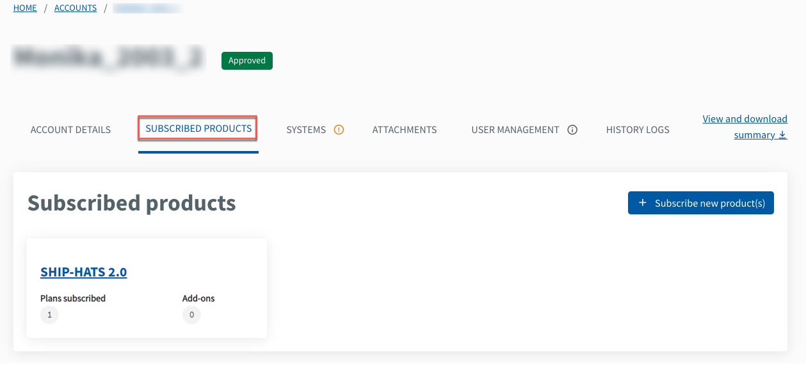
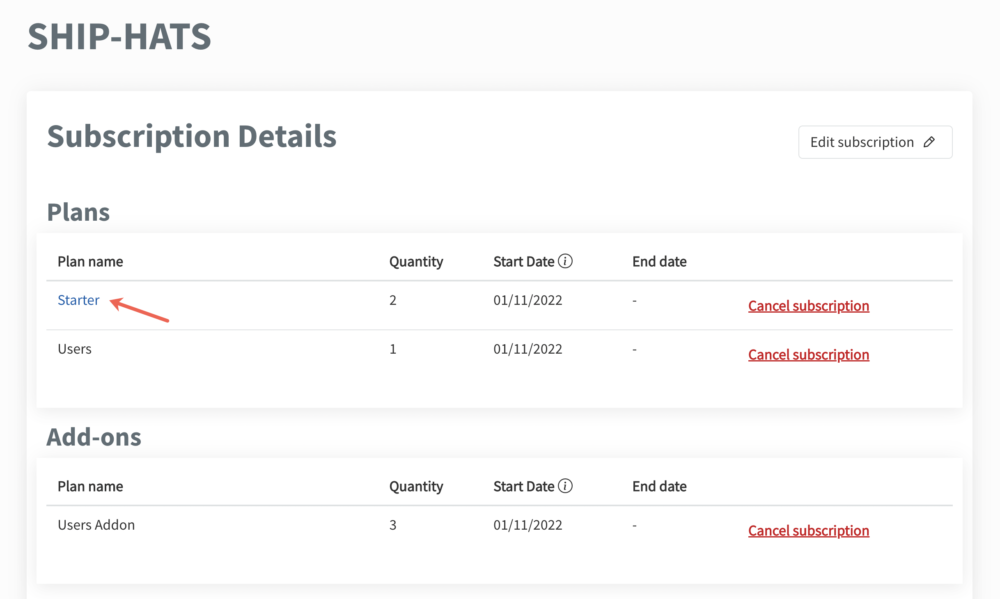
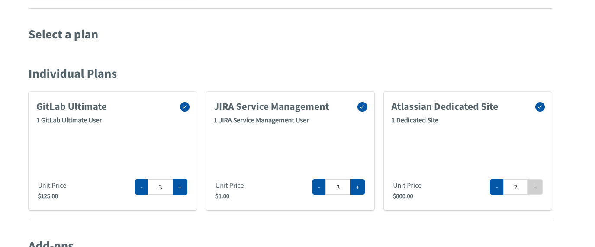
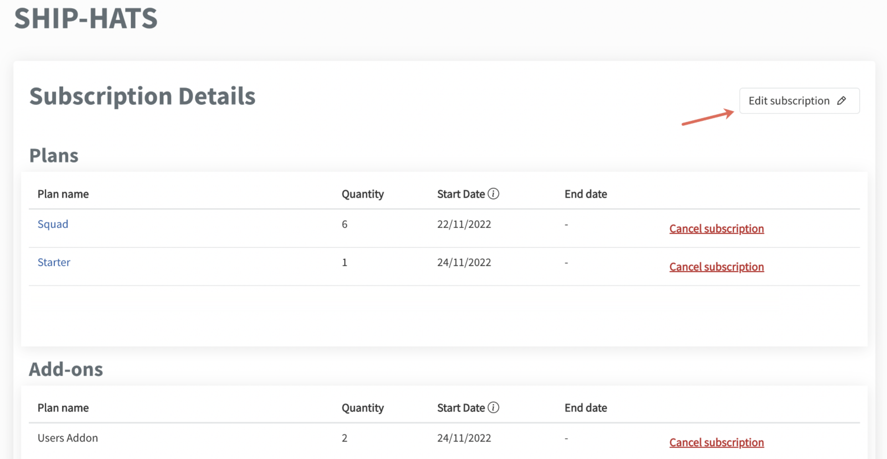
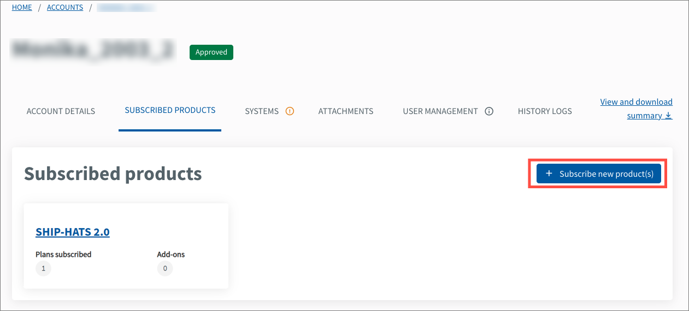

# Manage TechBiz account

## Overview

This section guides how subscription admins can edit and manage approved TechBiz account(s).

- [Change subscription and billing admins](#change-subscription-and-billing-information)

## Audience

- Primary and secondary subscription admins of a TechBiz account.
- Billing admin of a TechBiz account.

Note: The Billing admin of a TechBiz account can view the account and subscription details but can't edit the details.

## Prerequisites

- You need a [non-SE GSIB](https://docs.developer.tech.gov.sg/docs/techbiz-documentation/glossary) device.
- You need to be logged in to [TechBiz](https://portal.techbiz.suite.gov.sg/) portal.
- An approved [**TechBiz account**](https://docs.developer.tech.gov.sg/docs/techbiz-documentation/create-account).

## Change subscription and billing information

**Subscription admins** can remove and add a new subscription admin or update the billing information.

**To change the subscription admin or the billing info of a TechBiz account**

1. From the sidebar, click **Accounts**.
2. Select **APPROVED** from the **Status** dropdown list to view all the approved accounts.
3. Select the required account.
4. Click **ACCOUNT DETAILS** tab \> **Edit**.

<kbd></kbd>

5. To change the primary or secondary subscription admin, enter the organisational email address of the new subscription admin.
6. To change the billing admin, go to the **Billing admin section**, and enter the organisational email address of the new billing admin.

> **Note:**
> - As the admins are public officers, their TechPass ID is the same as their organisational email address.
> - To edit other details of a subscription or billing admin, the respective administrators must update their TechPass profile from the [TechPass portal](https://portal.techpass.suite.gov.sg). For more information, see [**TechPass user guide**](https://docs.developer.tech.gov.sg/docs/techpass-user-guide/edit-profile).

7. To change the SBU code, go to the **Billing information** section, and enter the new SBU code.
8. Click **Submit**.

A confirmation message is displayed.

# Manage subscriptions

This section guides how subscription admins can do the following for an existing subscription:

- [View subscription details](#view-subscription-details)
- [Edit subscription details](#view-subscription-details)
- [Subscribe to other SGTS products](#subscribe-to-other-sgts-products)
- [Cancel subscription](#cancel-subscription)

## Audience

- Primary and secondary subscription admins of a TechBiz account.
- Billing admin of a TechBiz account.

Note: The Billing admin of a TechBiz account can view the account and subscription details but can't edit the details.

## Prerequisites

- You need a [non-SE GSIB](https://docs.developer.tech.gov.sg/docs/techbiz-documentation/glossary) device.
- You need to be logged in to [TechBiz](https://portal.techbiz.suite.gov.sg/) portal.
- An approved [**TechBiz account**](https://docs.developer.tech.gov.sg/docs/techbiz-documentation/create-account).

## View subscription details

Billing and subscription admins can view the subscription plans and their details of the SGTS products subscribed using a TechBiz account.

**To view the subscription details of a TechBiz account**

1. From the sidebar, click **Accounts**.
2. Select **APPROVED** from the **Status** dropdown list to view all the approved accounts.
3. Select the required account.
4. Click **SUBSCRIPTIONS** tab.

<kbd></kbd>

5. To view the plan details of a SGTS product, select the required product and click the **Plan name**.

<kbd></kbd>

The **Plan details** are displayed.

<kbd></kbd>

> **Note:** The **Edit subscription** and **Cancel subscription** options are not available for Billing admins.

## Edit subscription details

**Subscription admins** can edit subscription details such as start date and subscription plans. You can also [add other SGTS products to the existing subscriptions](#subscribe-to-other-sgts-products).

**To edit subscription details of a TechBiz account**

1. From the sidebar, click **Accounts**.
2. Select **APPROVED** from the **Status** dropdown list to view all the approved accounts.
3. Select the required account.
4. Click **SUBSCRIPTIONS** tab.
5. Select the required product to edit. For example, SHIP-HATS.

<kbd></kbd>

11. Click **Edit subscription**.

<kbd></kbd>

12. You can edit the **Start date,** increase plans and add-ons. To decrease a plan, contact the respective SGTS support team.
2. Click **Next**.
3. Review the changes and click **Submit**.
4. When prompted to confirm the changes, click **Confirm**.

## Subscribe to other SGTS products

Subscription admins can subscribe to other SGTS products using TechBiz portal.

**To subscribe to other SGTS products**

1. From the sidebar, click **Accounts**.
2. Select **APPROVED** from the **Status** dropdown list to view all the approved accounts.
3. Select the required account.
4. Click **SUBSCRIPTIONS** tab \> **Add subscription**.

<kbd></kbd>

5. Select the required SGTS products and click **Next**.

For more information, Go to [**Create Account**](https://docs.developer.tech.gov.sg/docs/techbiz-documentation/create-account) and follow from step 11 onwards to complete the subscription.

## Cancel subscription

Contact the respective SGTS support team for more information.