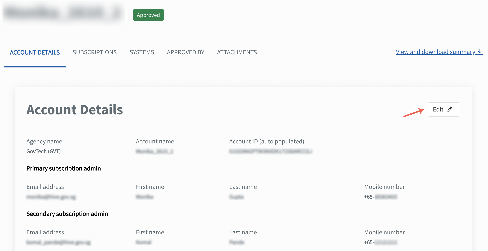

# Manage account

## Overview

This section guides how subscription admins can edit, manage approved TechBiz account(s) and view approver details and submitted attachments when required..

- [Change subscription admins and billing admins](#change-subscription-admins-and-billing-information)
- [View approver details and submitted attachments](#view-approver-details-and-attachments)

## Audience

- Primary and secondary subscription admins of a TechBiz account.
- Billing admin of a TechBiz account.

> **Note:** The Billing admin of a TechBiz account can view the account and subscription details but can't edit the details.

## Prerequisites

- You need a [non-SE GSIB](https://docs.developer.tech.gov.sg/docs/techbiz-documentation/glossary) device.
- You need to be logged in to [TechBiz](https://portal.techbiz.suite.gov.sg/) portal.
- An approved [**TechBiz account**](https://docs.developer.tech.gov.sg/docs/techbiz-documentation/create-account).

### Change subscription admins and billing information

**Subscription admins** can remove and add a new subscription admin or update the billing information.

1. From the sidebar, click **Accounts**.
2. Select **APPROVED** from the **Status** dropdown list to view all the approved accounts.
3. Select the required account.
4. Click **ACCOUNT DETAILS** tab \> **Edit**.

<kbd></kbd>

5. To change the primary or secondary subscription admin, enter the organisational email address of the new subscription admin.
6. To change the billing admin, go to the **Billing admin section**, and enter the organisational email address of the new billing admin.

> **Note:**
> - As the admins are public officers, their TechPass ID is the same as their organisational email address.
> - To edit other details of a subscription or billing admin, the respective administrators must update their TechPass profile from the [TechPass portal](https://portal.techpass.suite.gov.sg). For more information, see [**TechPass user guide**](https://docs.developer.tech.gov.sg/docs/techpass-user-guide/edit-profile).
> - If an admin is removed, they will no longer have access to the account.

7. To change the SBU code, go to the **Billing information** section, and enter the new SBU code.
8. Click **Submit**.

A confirmation message is displayed.

### View approver details and submitted attachments

1. From the sidebar, click **Accounts**.
2. Select the required status from **Status** dropdown list to view all the accounts in the required status.
3. Select the required account.
4. Click **APPROVED BY** tab to view approver details.

The following details are displayed.

<kbd></kbd>

> **Note:** Click **View and download summary to** download the details in .pdf file.

5. Click **ATTACHMENTS** tab to view the submitted attachments.

The following details are displayed.

<kbd></kbd>

6. Click the attachments in the item list to download the files.