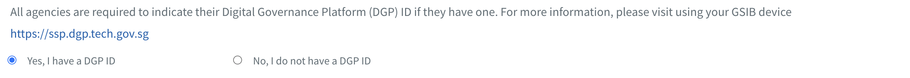
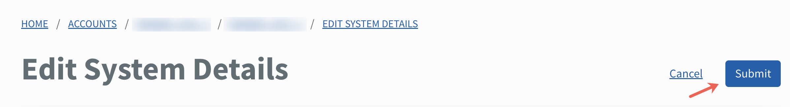

# Manage system

This section guides how subscription and technical admins can edit and manage TechBiz system(s).

- [Edit system](#edit-system)

## Audience

- Subscription admins of a TechBiz account.
- Technical admins of a TechBiz account.

## Prerequisites

- You need a [non-SE GSIB](https://docs.developer.tech.gov.sg/docs/techbiz-documentation/glossary) device.
- You need to be logged in to [TechBiz](https://portal.techbiz.suite.gov.sg/) portal.
- An approved **TechBiz account**.
- A **TechBiz system**.

**Edit System**

**Subscription admins and technical admins** can edit system description, update the status of your DGP sub-system and add sub-system ID, remove and add new technical admins.

**To edit system details**

1. From the sidebar, click **Accounts**.
2. Select **APPROVED** from the **Status** dropdown list to view all the approved accounts.
3. Select the required account.
4. Go to **SYSTEMS** tab.
5. Choose the required system and click **Manage** > **Edit**.
6. To edit the system description, enter the new description.

> **Note:** There is a limit of 255 characters.

7. To update the status of your Digital Governance Platform (DGP) ID, select the option button required.

<kbd></kbd>

Note: The **DGP sub-system ID** dropdown list appears when **Yes, I have a DGP ID** is selected.

8. Select the required sub-system ID from the **DGP sub-system ID** dropdown list.

> **Note:** Click **Add another** to add more DGP sub-systems.

9. To change the technical admin, go to the **Technical admin** section, and enter the organisational email address of the new technical admin.

> **Note:** If an admin is removed, they will no longer have access to the account.

10. Click **Submit.**

<kbd></kbd>

A confirmation message is displayed.

