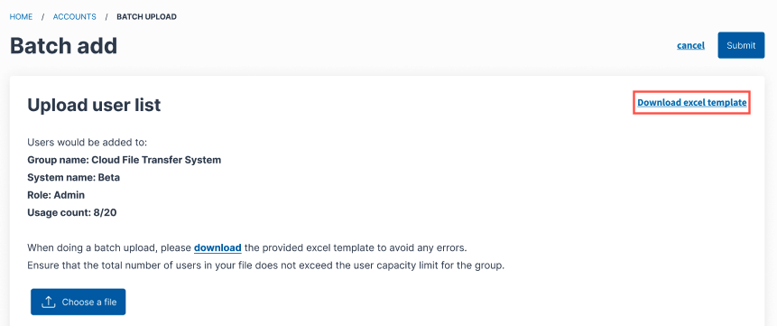
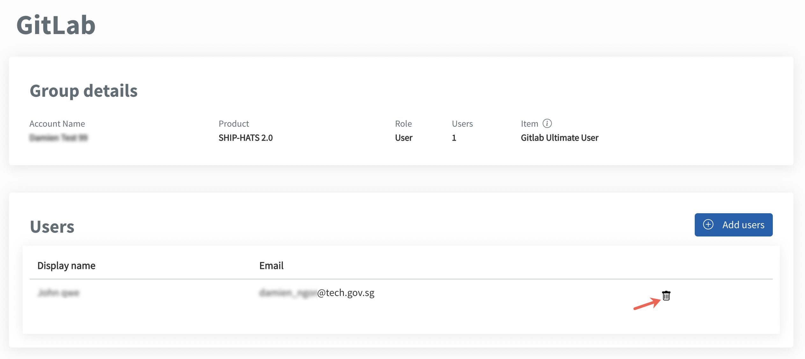

# Manage user access

Subscription and technical admins can control user access to the SGTS Products they have subscribed to. Subscription admins can manage both account and system user access, while technical admins can only manage system user access for the systems they are designated as admins.

> **Note:** Refer to the description text located underneath the tool label to understand the functionalities that the tool controls access to.

- [Add or remove users](#add-or-remove-users)

## Audience

- Primary and secondary subscription admins.
- Technical admins.

## Prerequisites

- You need a [non-SE GSIB](https://docs.developer.tech.gov.sg/docs/techbiz-documentation/glossary) device.
- You need to be logged in to [TechBiz](https://portal.techbiz.suite.gov.sg/) portal.
- An approved **TechBiz account**.
- A provisioned **TechBiz system**.

## Add or remove users

Subscription and technical admins can control user access to the SGTS Products they have subscribed to. Subscription admins can manage both account and system user access, while technical admins can only manage system user access for the systems they are designated as admins.

> **Note:** Refer to the description text located underneath the tool label to understand the functionalities that the tool controls access to.

**To add users**

1. From the sidebar, click **Accounts**.
2. Select **APPROVED** from the **Status** dropdown list to view all the approved accounts.
3. Select the required account.
4. Click **USER MANAGEMENT** tab.

<kbd></kbd>

5. Select the required Product from the **Products** dropdown list to select the SGTS Product tools to manage.
6. Select the required tool to add users. For example, GitLab.

<kbd></kbd>

7. Click **Manage** \> **Add users**.

<kbd></kbd>

> **Note:**
> - The usage count is linked to the corresponding subscription plan.
> - **Usage count** displays the quantity of assigned users and the maximum number of concurrent users authorised. For example, a count of 2/33 indicates that 2 out of the total 33 subscribed users have been assigned.

8. Enter the name or email address of the user.

<kbd></kbd>

> **Note:** 
> - User needs to have a TechPass account for their names to appear in the dropdown list.
> - Each user can only be added to one subscription account. Attempting to add a user to multiple subscription accounts will result in an error. 
> - To add a user to a specific Product, such as GitLab, Atlassian, SonarQube, or others, the user needs to access the Product itself and configure their user account accordingly. Each Product may have its own dedicated user management interface or settings panel where users can add, modify, or remove user accounts.

9. Click **Submit**.

<kbd></kbd>

**To add multiple users**

1. Click **Batch add**.

<kbd></kbd>

2. Download the **excel template**. Enter the required details on the excel sheet and save the file.

<kbd></kbd>

3. Click **Choose a file**. Select the required file.

<kbd></kbd>

4. Click **Submit**.

<kbd></kbd>

> **Note**: Admins may encounter common errors such as users already associated with another subscription account, users without a TechPass account, and incorrect email addresses.

**To remove a user**

1. From the sidebar, click **Accounts**.
2. Select **APPROVED** from the **Status** dropdown list to view all the approved accounts.
3. Select the required account.
4. Click **USER MANAGEMENT** tab.
5. Select the required Product from the **Products** dropdown list to select the SGTS Product tools to manage.
6. Select the required tool to remove users. For example, GitLab.

<kbd></kbd>

7. Click **Manage**.
8. Click the **delete icon** corresponding to the user's name.

<kbd></kbd>

9. Click **Confirm** to delete the user.

<kbd></kbd>

The user record is removed from the **Users** list.

**To remove multiple users**

1. Select the users.

<kbd></kbd>

2. Click **Remove selected**.

<kbd></kbd>

3. Click **Confirm**.

A confirmation message is displayed. 

  
Open Access

  There is now a third user type called *DashboardViewer*. By default, it is open to Public officers to view as a dashboard.
  
  The different roles appear under the row/column below: 
  
  

  To toggle switch (as shown in the image below) to manage access:
  
  

  If switched off, all users cannot access. However, specific users, including vendors, can be added.
  

