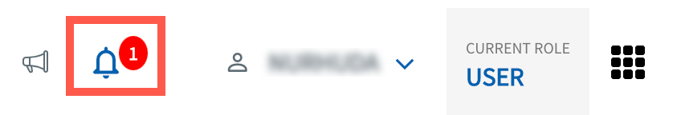
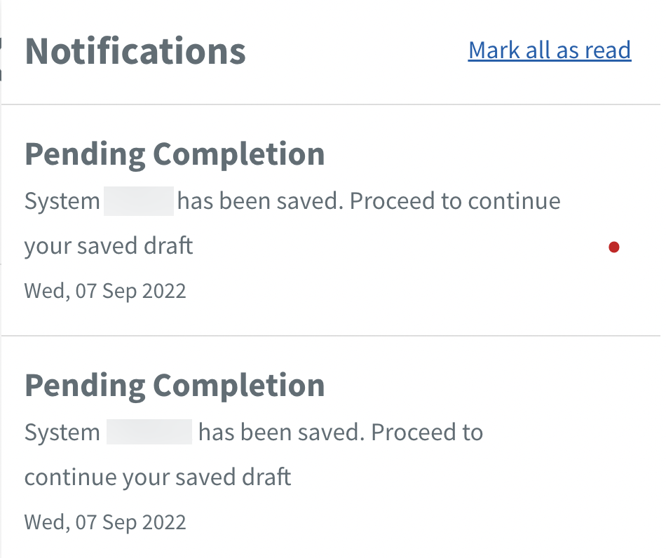
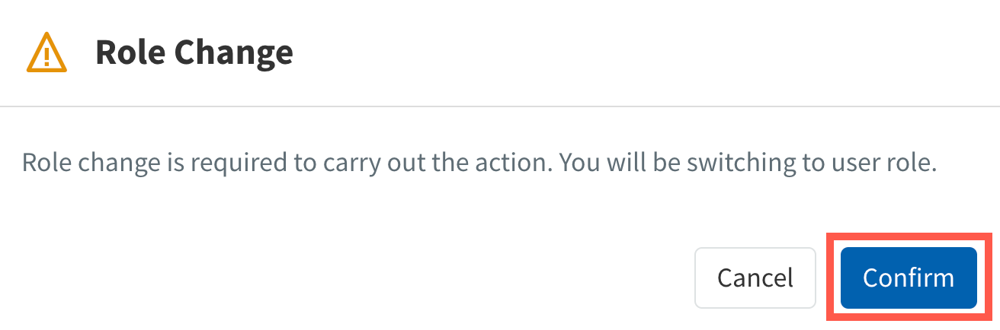

# Notifications

TechBiz notifies users of their request status and tasks awaiting their action. Users will receive notifications on the TechBiz portal and also by email. 

1. [Log in to TechBiz portal](log-in-to-TechBiz-portal) using your [non-SE GSIB](https://docs.developer.tech.gov.sg/docs/techbiz-documentation/glossary) or [GMD](https://docs.developer.tech.gov.sg/docs/security-suite-for-engineering-endpoint-devices/additional-resources/glossary?id=gmd) device.

2. Click **Notification**.

   

3. Click the required pending task.

   

>**Notes:**
> - A red dot beside a notification indicates it is unread.
> - Click **Mark all as read** to mark all the notifications as read.

4. If prompted to switch user role, click **Confirm** to switch.

   

5. Proceed to complete the task.

