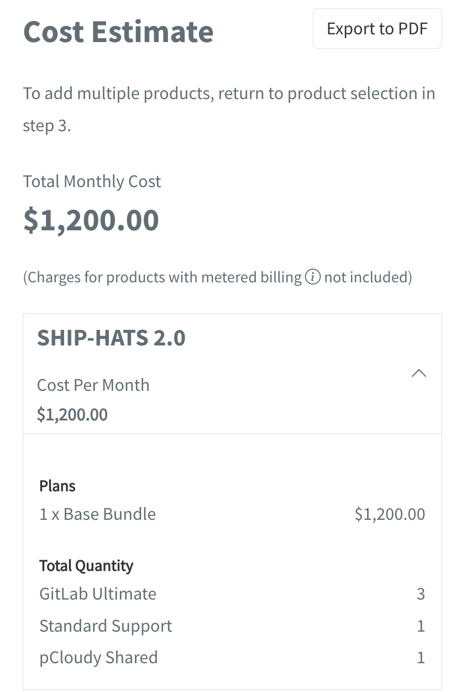

# Pricing calculator

The Pricing calculator in TechBiz allows subscription administrators to estimate costs by selecting products, plans, and quantities, providing a detailed breakdown before finalising subscriptions.

## When to use the pricing calculator

You may want to generate a cost estimate if you are:

1. Exploring SGTS Products
2. Subscribing to SGTS Products

This Pricing calculator is designed to provide you with a quick and accurate estimation of subscription costs.

**To generate cost estimate**:

1. From **Create subscription account**, under **Select products**, choose the required product(s).

<kbd></kbd>

> **Note**: If you are exploring SGTS Products, navigate to the sidebar and click **Pricing Calculator** and choose the product for which you want to estimate costs.

2. Select a **Start date** for when you want to start subscribing.

<kbd></kbd>

> **Note**: Not required for exploring SGTS products.

3. Choose a plan and specify the desired quantity.

<kbd></kbd>

> **Note**: To select add-ons, you must first choose a plan.

4. Select any necessary add-ons.

<kbd></kbd>

The estimated cost will be displayed on the right-side panel.

<kbd></kbd>

> **Note**: If you are exploring SGTS products, click **Add to estimate**.

**To save the cost estimate as a PDF**:

- Click **Export to PDF**.

<kbd></kbd>
