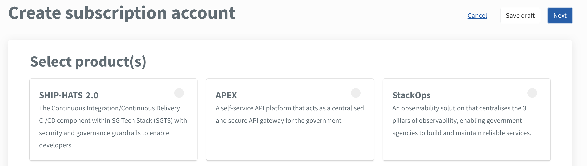
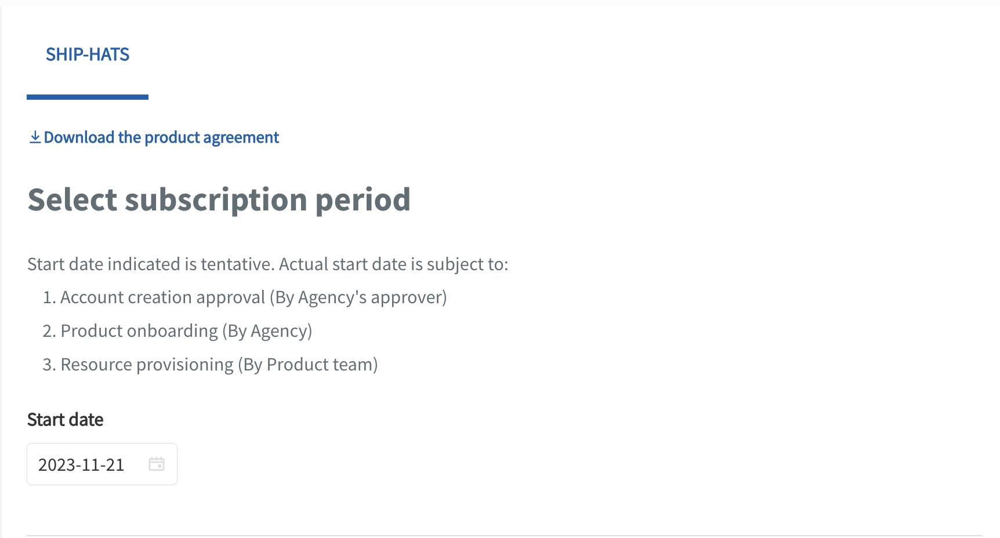
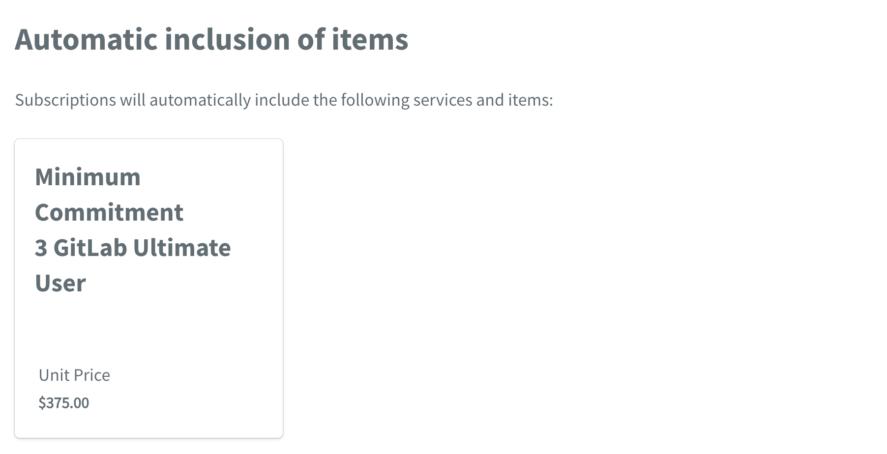
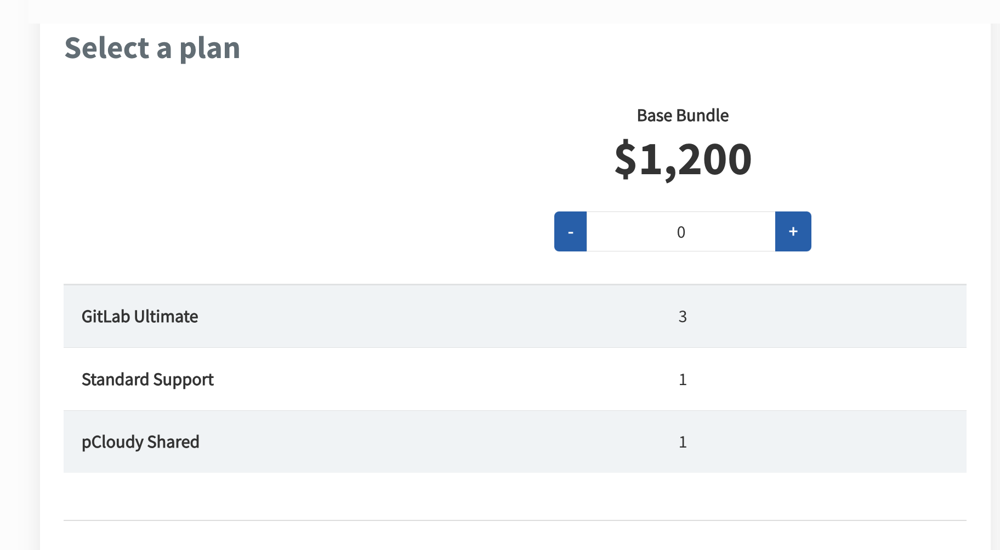
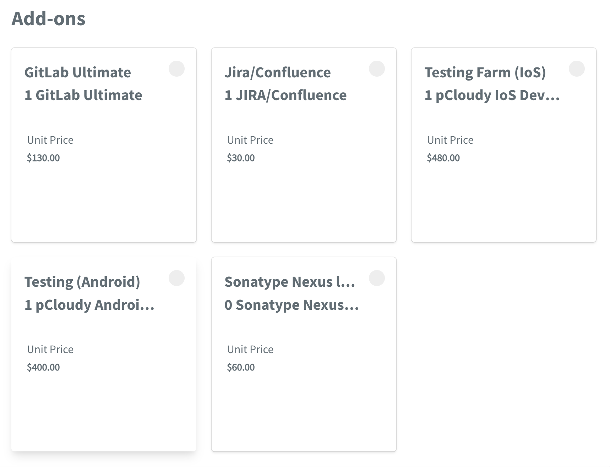
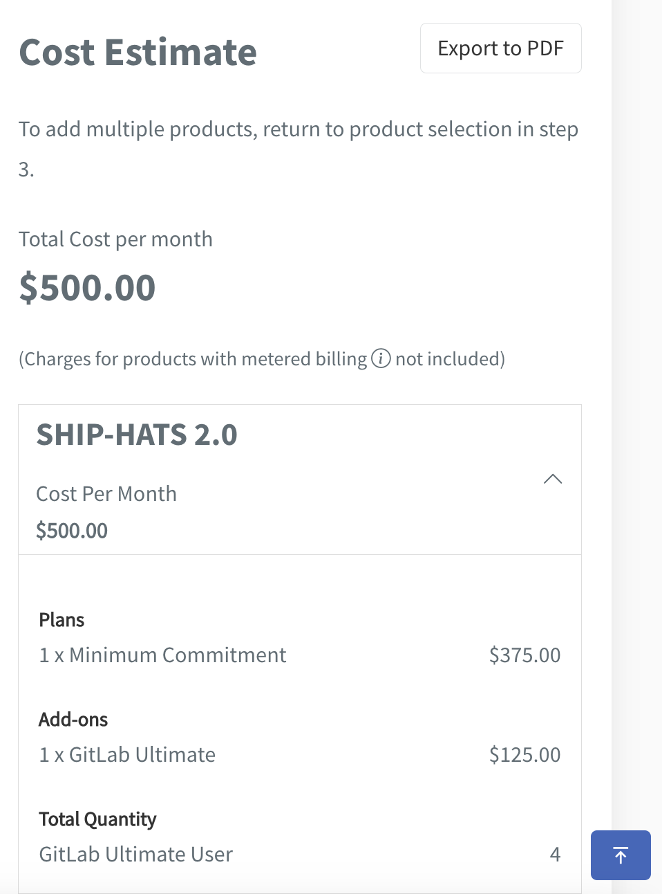
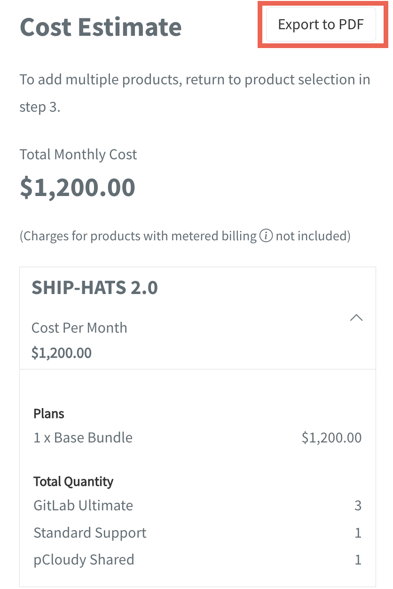

# Pricing calculator

The Pricing calculator in TechBiz allows subscription administrators to estimate costs by selecting products, plans, and quantities, providing a detailed breakdown before finalising subscriptions.

## When to use the pricing calculator

You may want to generate a cost estimate if you are:

1. Subscribing to SGTS Products
2. Exploring SGTS Products

This Pricing calculator is designed to provide you with a quick and accurate estimation of subscription costs.

> **Note:** For StackOps, you can refer to the [official pricing documentation](https://go.gov.sg/stackops-pricing).

> **Important:** For other products like APEX and CFT, pricing details may not be publicly available. Please check directly in the [TechBiz portal](https://portal.techbiz.suite.gov.sg/) after logging in.

## To generate cost estimate

1. From **Create subscription account**, under **Select products**, choose the required product(s).

   

> **Note**: If you are exploring SGTS Products, navigate to the sidebar and click **Pricing Calculator**. Choose the product for which you want to estimate costs.

2. Select a **Start date** for when you want to start subscribing.

   

> **Note**: Not required for exploring SGTS products.

Subscriptions will automatically include 3 GitLab Ultimate Users.

   

3. Choose a plan and specify the desired quantity.

   

> **Note**: To select add-ons, you must first choose a plan.

4. Select any necessary add-ons.

   

5. The estimated cost will be displayed on the right-side panel.

   

> **Note**: If you are exploring SGTS products, click **Add to estimate**.

## To save the cost estimate as a PDF

- Click **Export to PDF**.

   
