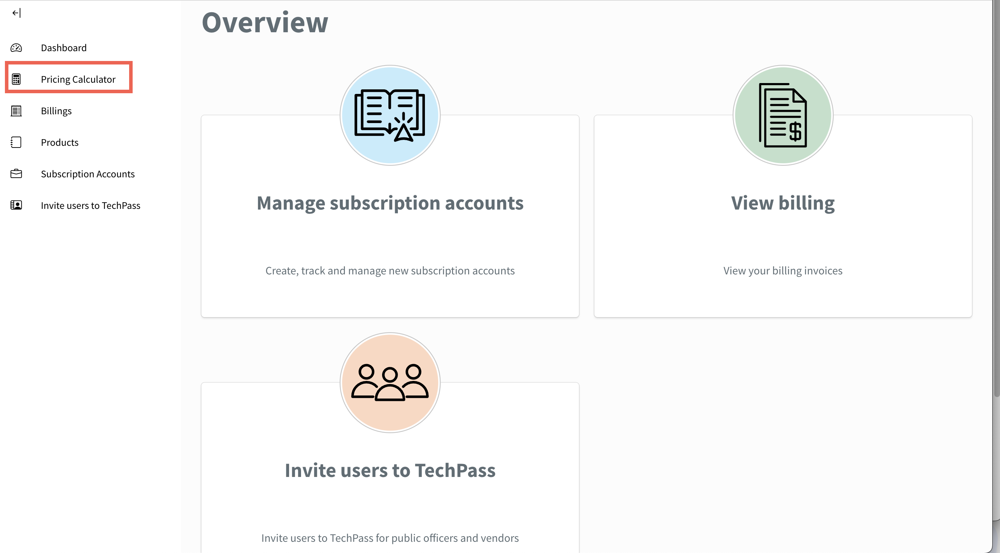
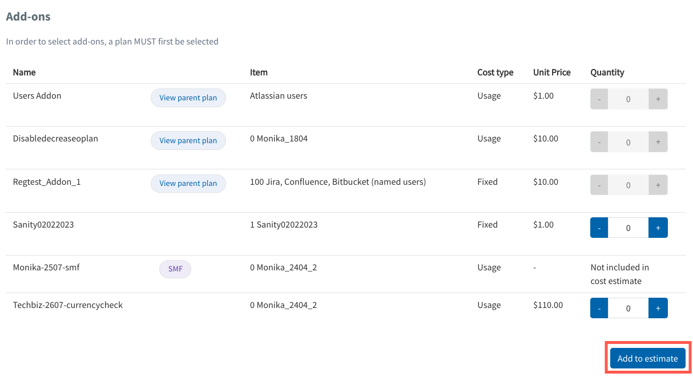
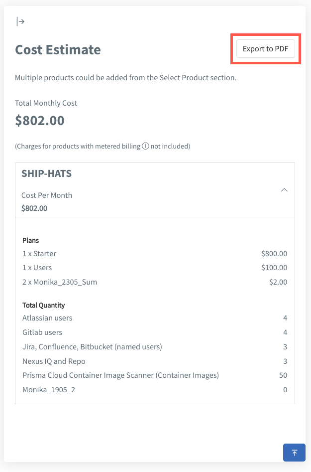

# Pricing calculator

The Pricing calculator in TechBiz allows subscription administrators to estimate costs by selecting products, plans, and quantities, providing a detailed breakdown before finalising subscriptions.

**To generate cost estimate**:

1. From the sidebar, click **Pricing Calculator**.

<kbd></kbd>

2. Choose the product for which you want to estimate costs.

<kbd></kbd>

3. Select a specific plan and indicate the desired quantity.

<kbd></kbd>

> **Note**: To select add-ons, you must first choose a plan.

4. Click **Add to estimate**.

<kbd></kbd>

The estimated cost will be displayed on the right-side panel.

**To save the cost estimate as a PDF**:
- Click **Export to PDF**.

<kbd></kbd>
