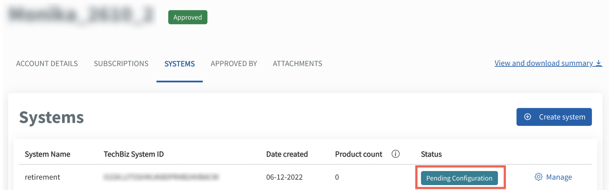

# TechBiz system

A system allows agencies to share usage of their [Singapore Government Tech Stack (SGTS)](https://www.developer.tech.gov.sg/singapore-government-tech-stack/overview/index.html) product subscriptions which can be configured and managed individually. A system is connected to a TechBiz account. An account can have multiple systems. Refer to the [FAQ](https://docs.developer.tech.gov.sg/docs/techbiz-documentation/faq) for more information.

Agencies need to add and configure TechBiz systems to manage the subscribed SGTS products.

This section guides how subscription admins can do the following:

- Create TechBiz system
- Add and configure subscribed products

## Audience

- Primary and secondary subscription admins of a TechBiz account.
- Technical admins of a TechBiz account

> **Note:** The Technical admin of a TechBiz account can add and configure subscribed SGTS products but can't create a new system.

## Prerequisites

- You need a [non-SE GSIB](https://docs.developer.tech.gov.sg/docs/techbiz-documentation/glossary) device.
- You need to be logged in to [TechBiz](https://portal.techbiz.suite.gov.sg/) portal.
- An approved [**TechBiz account.**](https://docs.developer.tech.gov.sg/docs/techbiz-documentation/create-account)

## Create TechBiz system

Subscription admins can create a TechBiz system using a TechBiz account.

**To create TechBiz system**

1. From the sidebar, click **Accounts.**
2. Select **APPROVED** from the **Status** dropdown list to view all the approved accounts.
3. Select the required account.
4. Click **SYSTEMS** tab \> **Create system**.

<kbd></kbd>

5. Enter the following details.

> **Note:** Unless mentioned otherwise, all fields are mandatory.

| **Field Name** | **Description** |
| --- | --- |
| **System name** | Enter the system name.   Note: System name can have a minimum of 1 character and maximum of 50 characters. |
| **TechBiz system ID** | A unique TechBiz system ID is automatically generated and cannot be edited. The TechBiz system ID is common across all subscribed SGTS products under this account. |
| **System Description** | Enter the description of the system. |
| **Digital Governance Platform (DGP) ID** | Indicate if your system has a DGP ID. Select **Yes** , **I have a DGP ID** or **No, I do not have a DGP ID**.     Note: Refer to [FAQ](https://docs.developer.tech.gov.sg/docs/techbiz-documentation/faq) for more information. |
| **Sub-system ID and description** | The sub-system DGP ID and description will be available if **Yes, I have a DGP ID** is selected. Select your DGP System ID. The System description will automatically appear.   Note: If you are unable to locate your DGP ID, click **No, I do not have a DGP ID** and update it when it is available. |

6. Enter the **technical admin** details.

| **Field Name** | **Description** |
| --- | --- |
| **Technical admin** | A Technical admin can edit and manage systems. This section allows you to enter the details of the Technical admin. There can be up to three technical admins. Note: Vendors can be technical admins. |
| **Email address** | Enter the organisation email address. |
| **First name, Last name, Contact number and Organisation.** | Enter the first name, last name, contact number and the organisation of the Technical admin. |

7. Click **Add another** to add more technical admins.

> **Note:** There can be a maximum of 3 technical admins.

8. Click **Next**.
9. Review the system details and click **Submit**.

The system will appear on the **Systems** page with **Pending Configuration** as its' status.

<kbd></kbd>

To complete the system configuration, go to **Add and configure subscribed products**.

## Add and configure subscribed products

Agencies need to add the subscribed SGTS products required for the system(s) and configure the products for each TechBiz system.

**To add and configure subscribed products**

1. From the sidebar, click **Accounts**.
2. Select **APPROVED** from the **Status** dropdown list to view all the approved accounts.
3. Select the required account.
4. Go to **SYSTEMS** tab.
5. Choose the required system and click **Manage**.
6. Go to **PRODUCTS** tab \> **Add Products**.

> **Note:** Each SGTS product will have different requirements for product configuration. Click the triangle to view product configuration instructions for the required SGTS products.

  
SHIP-HATS

7. Click **SHIP-HATS**.
8. Click **Next**.

<kbd></kbd>

9. Click **Submit**.

<kbd></kbd>

Go to [Access SHIP-HATS portal](https://docs.developer.tech.gov.sg/docs/ship-hats-portal/access-ship-hats-portal) for a guide to SHIP-HATS portal.

  
