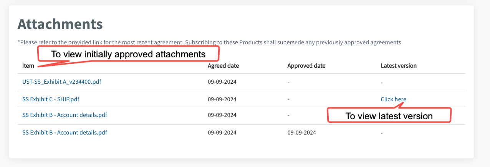

# View approver details and attachments

This section guides how subscription admins can view approver details and submitted attachments when required.

- [View approver details and submitted attachments](#view-approver-details-and-attachments)

## Audience

- Subscription admins of a TechBiz account.

## Prerequisites

- You need a [non-SE GSIB](https://docs.developer.tech.gov.sg/docs/techbiz-documentation/glossary) or [GMD](https://docs.developer.tech.gov.sg/docs/security-suite-for-engineering-endpoint-devices/additional-resources/glossary?id=gmd) device.
- You need to be logged in to [TechBiz](https://portal.techbiz.suite.gov.sg/) portal.
- A **TechBiz account** in pending, rejected, or approved status.

**To view approver details and submitted attachments**

1. From the sidebar, click **Accounts**.
2. Select the required status from **Status** dropdown list to view all the accounts in the required status.
3. Select the required account.
4. Click **APPROVED BY** tab to view approver details.

The following details are displayed:

   

> **Note:** Click **View and download summary** to download the details in a .pdf file.

5. Click **ATTACHMENTS** tab to view the submitted attachments.

The following details are displayed:

   

6. Click the attachments in the item list to download the files.
